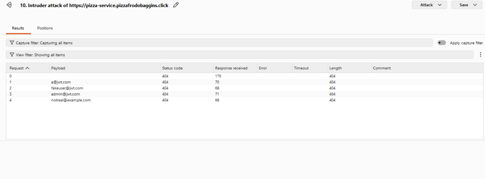
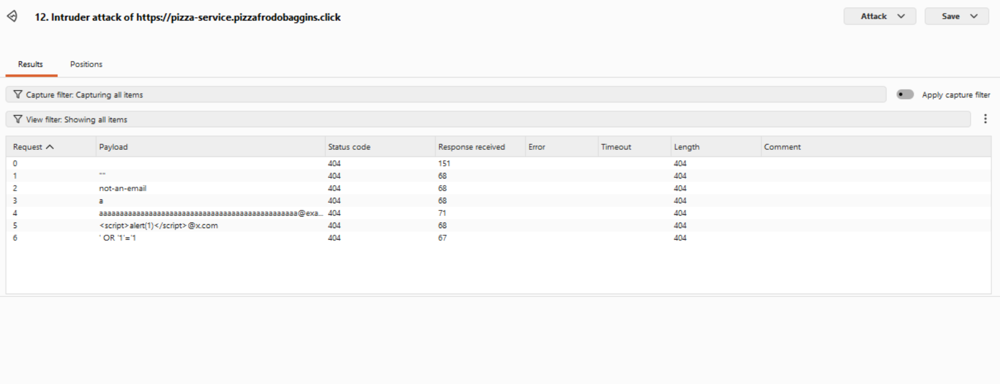
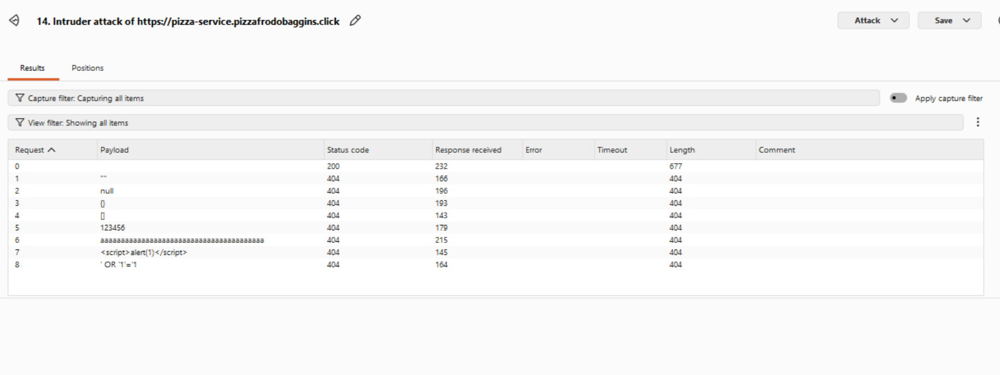
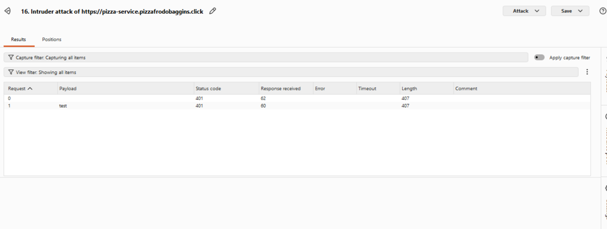
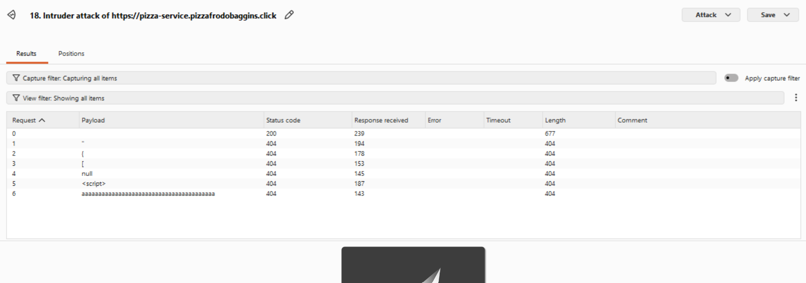
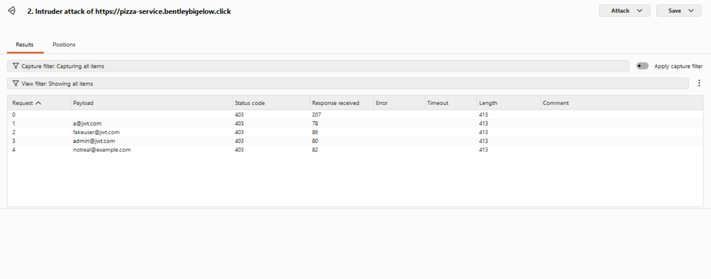
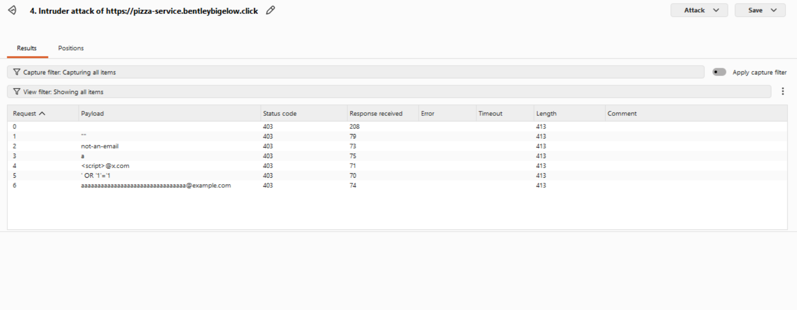
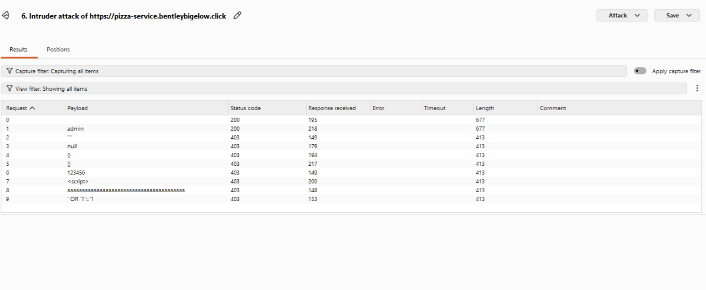
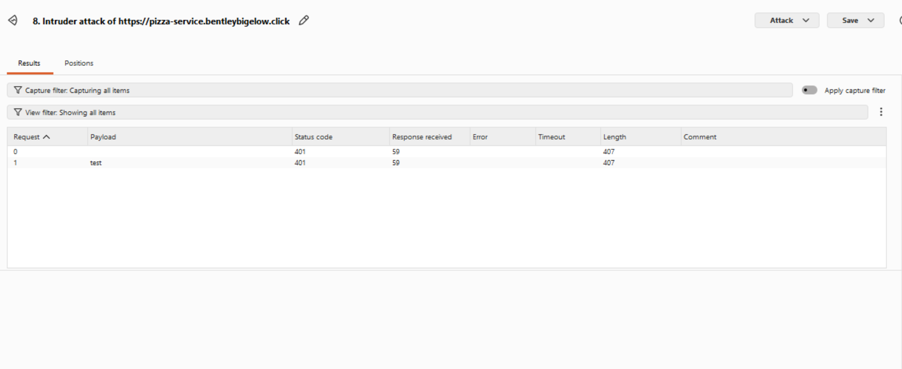
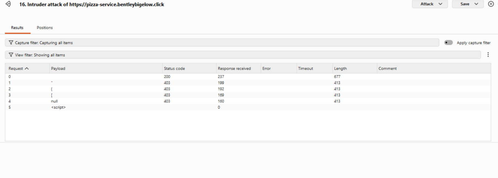

# CS 329 Deliverable #12: Penetration Testing

**Assigned Peers:** Jordan and Bentley Bigelow
**Date:** 04/11/26

---

# Jordan's Self-Inflicted Penetration Tests

## 1. Login Enumeration Probe

| Item           | Result                                                                                                                                                                                                                                                                                                                                                               |
| -------------- | -------------------------------------------------------------------------------------------------------------------------------------------------------------------------------------------------------------------------------------------------------------------------------------------------------------------------------------------------------------------- |
| Date           | April 13, 2026                                                                                                                                                                                                                                                                                                                                                       |
| Target         | pizza.pizzafrodobaggins.click                                                                                                                                                                                                                                                                                                                                        |
| Classification | Identification and Authentication Failures                                                                                                                                                                                                                                                                                                                           |
| Severity       | 0                                                                                                                                                                                                                                                                                                                                                                    |
| Description    | Used Burp Suite Intruder to test multiple email values against the authentication endpoint using the same incorrect password. Tested values included valid-format and fake accounts. All requests returned HTTP 404 with identical response lengths and similar timings, indicating no obvious user enumeration through these response differences during this test. |
| Images         |                                                                                                                                                                                                                                                                                                                                           |
| Corrections    | None required based on this test. Continue using consistent responses for authentication failures and consider rate limiting repeated login attempts.                                                                                                                                                                                                                |

---

## 2. Input Validation / Injection Probe

| Item           | Result                                                                                                                                                                                                                                                                                                                                                                |
| -------------- | --------------------------------------------------------------------------------------------------------------------------------------------------------------------------------------------------------------------------------------------------------------------------------------------------------------------------------------------------------------------- |
| Date           | April 13, 2026                                                                                                                                                                                                                                                                                                                                                        |
| Target         | pizza.pizzafrodobaggins.click                                                                                                                                                                                                                                                                                                                                         |
| Classification | Injection                                                                                                                                                                                                                                                                                                                                                             |
| Severity       | 0                                                                                                                                                                                                                                                                                                                                                                     |
| Description    | Used Burp Suite Intruder to send malformed and suspicious values in the email field of the authentication request, including invalid formats, oversized input, script tags, and SQL-style strings. All requests returned HTTP 404 with identical response lengths and no visible errors, indicating the application handled these probes consistently during testing. |
| Images         |                                                                                                                                                                                                                                                                                                                                            |
| Corrections    | None required based on this test. Continue validating inputs server-side and returning generic error responses.                                                                                                                                                                                                                                                       |

---

## 3. Password Mutation Probe

| Item           | Result                                                                                                                                                                                                                                                                                                                                                                                                       |
| -------------- | ------------------------------------------------------------------------------------------------------------------------------------------------------------------------------------------------------------------------------------------------------------------------------------------------------------------------------------------------------------------------------------------------------------ |
| Date           | April 13, 2026                                                                                                                                                                                                                                                                                                                                                                                               |
| Target         | pizza.pizzafrodobaggins.click                                                                                                                                                                                                                                                                                                                                                                                |
| Classification | Input Validation                                                                                                                                                                                                                                                                                                                                                                                             |
| Severity       | 0                                                                                                                                                                                                                                                                                                                                                                                                            |
| Description    | Used Burp Suite Intruder to modify the password field with unexpected values including empty input, null, objects, arrays, numeric values, oversized strings, script payloads, and SQL-style strings. The valid baseline request returned HTTP 200, while malformed variants consistently returned HTTP 404 with uniform response sizes, indicating unexpected password inputs were rejected during testing. |
| Images         |                                                                                                                                                                                                                                                                                                                                                                                   |
| Corrections    | None required based on this test. Continue strict server-side validation and consistent error handling.                                                                                                                                                                                                                                                                                                      |

---

## 4. Unauthorized Access Probe

| Item           | Result                                                                                                                                                                                                                |
| -------------- | --------------------------------------------------------------------------------------------------------------------------------------------------------------------------------------------------------------------- |
| Date           | April 13, 2026                                                                                                                                                                                                        |
| Target         | pizza.pizzafrodobaggins.click                                                                                                                                                                                         |
| Classification | Broken Access Control                                                                                                                                                                                                 |
| Severity       | 0                                                                                                                                                                                                                     |
| Description    | Used Burp Suite Intruder to request a protected API endpoint without valid authentication. All requests returned HTTP 401 with identical response lengths, indicating unauthorized access was blocked during testing. |
| Images         |                                                                                                                                                                                            |
| Corrections    | None required based on this test. Continue enforcing authentication checks on protected routes.                                                                                                                       |

---

## 5. Error Handling and Malformed Authentication Payload Probe

| Item           | Result                                                                                                                                                                                                                                                                                                                                                                                                                   |
| -------------- | ------------------------------------------------------------------------------------------------------------------------------------------------------------------------------------------------------------------------------------------------------------------------------------------------------------------------------------------------------------------------------------------------------------------------ |
| Date           | April 13, 2026                                                                                                                                                                                                                                                                                                                                                                                                           |
| Target         | pizza.pizzafrodobaggins.click                                                                                                                                                                                                                                                                                                                                                                                            |
| Classification | Security Misconfiguration                                                                                                                                                                                                                                                                                                                                                                                                |
| Severity       | 0                                                                                                                                                                                                                                                                                                                                                                                                                        |
| Description    | Used Burp Suite Intruder to submit malformed values in the authentication request, including broken characters, partial JSON fragments, null values, script payloads, and oversized strings. The valid baseline request returned HTTP 200, while malformed values consistently returned HTTP 404 with uniform response lengths. No stack traces, internal paths, or sensitive debug details were exposed during testing. |
| Images         |                                                                                                                                                                                                                                                                                                                                                                                               |
| Corrections    | None required based on this test. Continue returning generic errors and suppressing internal exception details.                                                                                                                                                                                                                                                                                                          |

---

# Bentley's Self-Inflicted Penetration Tests

## 1. Login Brute Force / Auth Stress

| Item           | Result                                                                                                                                                                                                                                                                                                                                                   |
| -------------- | -------------------------------------------------------------------------------------------------------------------------------------------------------------------------------------------------------------------------------------------------------------------------------------------------------------------------------------------------------- |
| Date           | April 11, 2026                                                                                                                                                                                                                                                                                                                                           |
| Target         | https://pizza-service.bentleybigelow.click                                                                                                                                                                                                                                                                                                               |
| Classification | Identification and Authentication Failures                                                                                                                                                                                                                                                                                                               |
| Severity       | 1                                                                                                                                                                                                                                                                                                                                                        |
| Description    | Repeated wrong-password logins were used to identify auth behavior and account discovery by using a real email and a fake email. With a real user email and wrong password, responses were `403`. With a non-existent email and wrong password, responses were `404`. Different status codes allow an attacker to tell registered emails from fake ones. |
| Images         |                                                                                                                                                                                                                                                                                          |
| Corrections    | Return a single generic outcome for incorrect credentials and add rate limiting by IP.                                                                                                                                                                                                                                                                   |

---

## 2. Injection Probes on List Name Query Parameters

| Item           | Result                                                                                                                                                                               |
| -------------- | ------------------------------------------------------------------------------------------------------------------------------------------------------------------------------------ |
| Date           | April 11, 2026                                                                                                                                                                       |
| Target         | https://pizza-service.bentleybigelow.click                                                                                                                                           |
| Classification | Injection                                                                                                                                                                            |
| Severity       | 0                                                                                                                                                                                    |
| Description    | Crafted SQL-style strings were sent in the `name` parameter on `GET /api/user`. Every attempt returned only `{"message":"unauthorized"}` with no database errors or unexpected rows. |
| Images         |                                                                                                                            |
| Corrections    | None needed, inputs are parameterized before use.                                                                                                                                    |

---

## 3. Broken Access Control (Admin Lists and Cross-User Delete)

| Item           | Result                                                                                                                   |
| -------------- | ------------------------------------------------------------------------------------------------------------------------ |
| Date           | April 11, 2026                                                                                                           |
| Target         | https://pizza-service.bentleybigelow.click                                                                               |
| Classification | Broken Access Control                                                                                                    |
| Severity       | 0                                                                                                                        |
| Description    | Non-admin attempts to perform admin actions returned `401` or `403`. No admin listing or cross-user delete went through. |
| Images         |                                                            |
| Corrections    | None needed, non-admins are prevented from performing admin functions.                                                   |

---

## 4. JWT Tampering / Privilege Probe

| Item           | Result                                                                                                                    |
| -------------- | ------------------------------------------------------------------------------------------------------------------------- |
| Date           | April 11, 2026                                                                                                            |
| Target         | https://pizza-service.bentleybigelow.click                                                                                |
| Classification | Cryptographic Failures                                                                                                    |
| Severity       | 0                                                                                                                         |
| Description    | A modified JWT with elevated roles was rejected. The attack failed to turn a non-admin JWT into an admin-capable session. |
| Images         |                                                                     |
| Corrections    | None needed, tampered tokens are rejected.                                                                                |

---

## 5. Diner Deletes a Franchise

| Item           | Result                                                                                                                                                                     |
| -------------- | -------------------------------------------------------------------------------------------------------------------------------------------------------------------------- |
| Date           | April 11, 2026                                                                                                                                                             |
| Target         | https://pizza-service.bentleybigelow.click                                                                                                                                 |
| Classification | Broken Access Control                                                                                                                                                      |
| Severity       | 3                                                                                                                                                                          |
| Description    | A diner/non-admin user was able to delete any franchise by ID. The service returned `200` and the franchise was actually deleted, causing unauthorized destructive impact. |
| Images         |                                                                                                                   |
| Corrections    | Enforce ownership/admin authorization checks before franchise deletion.                                                                                                    |

---

# Jordan's Penetration Tests on Bentley's JWT Pizza

## 1. Login Enumeration Probe

| Item           | Result                                                                                                                                                                                                                                                                                                              |
| -------------- | ------------------------------------------------------------------------------------------------------------------------------------------------------------------------------------------------------------------------------------------------------------------------------------------------------------------- |
| Date           | April 13, 2026                                                                                                                                                                                                                                                                                                      |
| Target         | pizza.bentleybigelow.click                                                                                                                                                                                                                                                                                          |
| Classification | Identification and Authentication Failures                                                                                                                                                                                                                                                                          |
| Severity       | 0                                                                                                                                                                                                                                                                                                                   |
| Description    | Used Burp Suite Intruder to test multiple account values against the authentication endpoint using the same incorrect password. All tested values returned HTTP 403 with identical response lengths and similar response times, indicating no obvious user enumeration through response differences during testing. |
| Images         |                                                                                                                                                                                                                                                                                 |
| Corrections    | None required based on this test. Continue using consistent authentication failure responses and consider rate limiting repeated login attempts.                                                                                                                                                                    |

---

## 2. Input Validation and Injection Probe

| Item           | Result                                                                                                                                                                                                                                                                                                                                                                          |
| -------------- | ------------------------------------------------------------------------------------------------------------------------------------------------------------------------------------------------------------------------------------------------------------------------------------------------------------------------------------------------------------------------------- |
| Date           | April 13, 2026                                                                                                                                                                                                                                                                                                                                                                  |
| Target         | pizza.bentleybigelow.click                                                                                                                                                                                                                                                                                                                                                      |
| Classification | Injection                                                                                                                                                                                                                                                                                                                                                                       |
| Severity       | 0                                                                                                                                                                                                                                                                                                                                                                               |
| Description    | Used Burp Suite Intruder to submit malformed and suspicious values in the email field of the authentication request, including invalid formats, script-style input, SQL-style strings, and oversized values. All requests returned HTTP 403 with identical response lengths and no visible errors, indicating the application handled these probes consistently during testing. |
| Images         |                                                                                                                                                                                                                                                                                                                                             |
| Corrections    | None required based on this test. Continue validating inputs server-side and returning generic authentication errors.                                                                                                                                                                                                                                                           |

---

## 3. Password Mutation Probe

| Item           | Result                                                                                                                                                                                                                                                                                                                                                                                                           |
| -------------- | ---------------------------------------------------------------------------------------------------------------------------------------------------------------------------------------------------------------------------------------------------------------------------------------------------------------------------------------------------------------------------------------------------------------- |
| Date           | April 13, 2026                                                                                                                                                                                                                                                                                                                                                                                                   |
| Target         | pizza.bentleybigelow.click                                                                                                                                                                                                                                                                                                                                                                                       |
| Classification | Input Validation                                                                                                                                                                                                                                                                                                                                                                                                 |
| Severity       | 0                                                                                                                                                                                                                                                                                                                                                                                                                |
| Description    | Used Burp Suite Intruder to modify the password field with unexpected values including empty input, null, objects, arrays, numeric values, script-style input, oversized strings, and SQL-style strings. The valid baseline credential returned HTTP 200, while malformed values consistently returned HTTP 403 with uniform response sizes, indicating unexpected password inputs were rejected during testing. |
| Images         |                                                                                                                                                                                                                                                                                                                                                                              |
| Corrections    | None required based on this test. Continue strict validation and generic authentication responses.                                                                                                                                                                                                                                                                                                               |

---

## 4. Unauthorized Access Probe

| Item           | Result                                                                                                                                                                                                                |
| -------------- | --------------------------------------------------------------------------------------------------------------------------------------------------------------------------------------------------------------------- |
| Date           | April 13, 2026                                                                                                                                                                                                        |
| Target         | pizza.bentleybigelow.click                                                                                                                                                                                            |
| Classification | Broken Access Control                                                                                                                                                                                                 |
| Severity       | 0                                                                                                                                                                                                                     |
| Description    | Used Burp Suite Intruder to request a protected API endpoint without valid authentication. All requests returned HTTP 401 with identical response lengths, indicating unauthorized access was blocked during testing. |
| Images         |                                                                                                                                                                                   |
| Corrections    | None required based on this test. Continue enforcing authentication checks on protected routes.                                                                                                                       |

---

## 5. Error Handling Probe

| Item           | Result                                                                                                                                                                                                                                                                                                                                                                                                 |
| -------------- | ------------------------------------------------------------------------------------------------------------------------------------------------------------------------------------------------------------------------------------------------------------------------------------------------------------------------------------------------------------------------------------------------------ |
| Date           | April 13, 2026                                                                                                                                                                                                                                                                                                                                                                                         |
| Target         | https://pizza-service.bentleybigelow.click                                                                                                                                                                                                                                                                                                                                                             |
| Classification | Security Misconfiguration                                                                                                                                                                                                                                                                                                                                                                              |
| Severity       | 0                                                                                                                                                                                                                                                                                                                                                                                                      |
| Description    | Used Burp Suite Intruder to submit malformed values in the authentication request, including broken characters, partial JSON fragments, null values, and script-style input. The valid baseline request returned HTTP 200, while malformed values consistently returned HTTP 403 with uniform response sizes. No stack traces, internal paths, or sensitive debug details were exposed during testing. |
| Images         |                                                                                                                                                                                                                                                                                                                                                                    |
| Corrections    | None required based on this test. Continue returning generic errors and suppressing internal exception details.                                                                                                                                                                                                                                                                                        |

---

# Bentley's Penetration Tests on Jordan's JWT Pizza

(Add Bentley's peer attack results here.)

---

# Summary of Learnings

* Consistent authentication responses reduce account enumeration risk.
* Strong authorization checks are critical for destructive actions.
* Generic error handling helps prevent information leakage.
* Input validation reduces injection and malformed request risks.
* JWT signatures must always be validated server-side.
